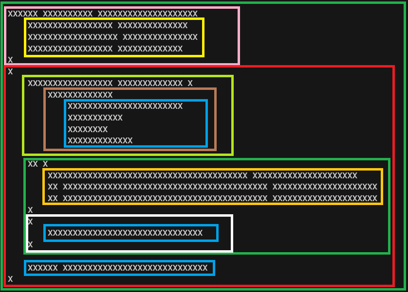

# Code style holy wars

**NOTE: Further version if any can be found [here](https://github.com/AndreiShenets/AndreiShenets/blob/main/code-style-holy-wars/README.md)**

## A bit of context. Why?

"*I have been keen on forcing code styles since time short after I started writing code using Delphi language. The reason is quite simple - undoubtedly styled code much more readable and easy to understand.*"

That were the first sentences from the introduction part of the [previous version](https://github.com/AndreiShenets/code-styles/tree/8d99ae257e0d7a6c26bf83cd34107c3a9421765a) of this text. Was it the true reason? Didn't I lie to myself about it? I think I did at least partially. The true reason was I wanted my code looked in a way I like. Yes, I mostly wanted to like my code visually. When I read non-stopping holy wars about tabs vs spaces, where to put brackets, vars vs explicit types and so on I think others do the same.

In this text I would like to share my empirical observations regarding what is important, how I format code and why I choose a particular code style. I would like to share principles I came to, how I came to them and what reasons are underneath.

### What should be taken in account

#### Primary programming language is a bias

My code style has been changing from time to time since I was writing on Pascal and Delphi at university. It significantly changed when I switched to C\# and when I started to write frontend code using HTML, CSS, JavaScript, later Typescript. Let's add to the context SQL, WPF, React, Angular, a bit of C, C++, Lisp, Go, Java and Python. I cannot even remember all languages I tried or wrote but each language gave me additional issues, examples, style practices and habits. Nevertheless, my primary language has always been dominating. For example, the same when someone can be observed when someone comes from Java world to C# world.

**The key take away:** It would be great to have non-biased cross language principles. *Is it only my nature to invent universal principles?*

#### There are always unsatisfied people

There are always people that would like to do something in different way. There are always people that think differently. There are always additional contexts, languages, habits, reasons of doing things. That is completely ok. That is why there are always people that are not satisfied with ideal cross language principles. Especially if you try to make law-like-rules. People also like to be free in their decisions.

That why I would like to have principles as **recommendations** or **strong recommendations**. It is still something to follow but there can be exclusions or adaptions if something is not covered. Also, I would like to clearly explain and prove the principles to persuade people that they matter.

It looks achievable to recommend some universal principles which can significantly improve the quality of any code in different aspects. These principles must be revisited, analyzed, simplified, improved each time a new context is added.

**The key take away:** Principles as **recommendations**.

#### People do not want to learn and follow complex rules

That is part of people psychology and we cannot fight against.

**The key take away:** Principles should be easy to follow and explain.

#### There are people who do not care

Unfortunately, that is true. Sometimes it is only because nobody explained why they should care. Sometimes they just do not care. The only thing can be done here is people who care should explain people who do not care why they should care too, and principles should help with that. Also following the recommendations or rules should be as easy as possible. Ideally tools should support the principles and help to follow them automagically.

**The key take away:** Principles should help to persuade others to follow them. Principles should bring real value to everybody. Principles should be easy to follow.

### And yet why?

Ok, there is a lot of text with observations and what?

I found that process is like building of software. An architect comes to a customer's side. The customer starts to tell the architect what software should do but next architect questions will be likely "why should it do this and not that" and "what do you expect as result and how to understand that the result actually has good enough quality".

So, I still haven't described the initial reason, result and metrics to measure the result.

I think that the initial reason is "People would like to write code with pleasure". Pleasure can mean easy or when we like code visually. "To like our code" might be something about endorphins. The easiness might be an effect that our brain is a lazy bastard who doesn't like to work. The reason for that is evolution - our brain consumes too many resources to think a lot and properly, so he tries to cheat whenever is possible.

**The key take away:** Principles should reduce amount of thinking while coding as much as possible and if possible make code nicer to give esthetic pleasure.

There is a second part - measurements. Unfortunately, I don't have an answer here. How can we measure easiness of coding or code? The only existing method that comes to my mind is measuring cyclomatic complexity. My observation that it helps indirectly but doesn't provide easy-enough-to-follow principles. It might be that an improved team productivity or happiness and reduced number of errors can be measured over time but those consist of so many variables that it is hard to say what add value. Has someone other ideas? Please read the article until the end first and let's discuss.

**The key take away:** how to measure pleasure?

## Changing point. How?

The key changing point for me happened when I watched [Kevlin Henney - Seven Ineffective Coding Habits of Many Programmers](https://vimeo.com/97329157) video. It highlights important things in a code style. The things there are quite important, but I would say they are still effects and not the base principles. Nevertheless, I think, there I found a link to the [Clean Up Your Mess — A Guide to Visual Design for Everyone](http://www.visualmess.com/) article from *Daniel Higginbotham*.

The article is not even about programming it is about visual design and how to help our brain to understand things easier. Isn't it what we need during coding? We need to help our brains to reduce a cognitive load while we are expressing our masterpieces using plain text! That makes us happy and not tabs or spaces!

The article highlights that there are two mechanisms of thinking Visual Thinking and Logical Thinking.

Visual Thinking is kind of fast pattern matching or O(1) access to an in memory cache.

Logical Thinking is fall back of Visual Thinking and kind of a cache miss and a complete recalculation and/or a data reload as result.

So the brain cheating mechanism is actually an imperfectly implemented optimization.

### Combining things together

What helps a brain be move efficient? What characteristics of it should be taken in account in the principles? What do we know about coding process that can help to express the principles?

Let me use a method I use when I need to analyze a lot of requirements and extract of them important, non-duplicated, good formulated and so on. I am placing all things in lists with some structure and nesting. I call them structured lists.

#### Compacting and enriching the observations and axioms using structured list - iteration 1

While coding we
- read code 80% or time and write only 20%. I observe agreement that reading > writing but percents can vary. So reading is more important than writing
- have own biases and preferences

Coding is not just coding. Common actions are
- Reading
- Reading using one monitor but two panel editor
- Writing first / Changing later
- Writing / Changing in editor using two or more panels
- Comparing / Comparing in a tool with two panels
- Merge conflict solving in a tool with three panels
- Pull request reading using tool or browser. Also, can be two panels.

Readability improves when
- our eyes have narrow vision area. If narrow vision is considered then
  - line length limitation exists to
    - get rid of horizontal scrolling that is unhandy and time-consuming
    - get rid of long lines that hide important parts of code abroad screen
  - line length limitation can be
    - adjustable for a team hardware and habits
      - default and recommended in range of 80-120 symbols
    - two panel side by side should be visible and readable
- visual thinking and pattern recognition -> O(1) access by hash
- explicit is better than implicit
  - things should be obvious when you read them

Writability improves when
- code is easy to write
- code is sustainable
  - modification does not trigger addition modifications
  - code is not fragile
    - your changes should not break code around

Brain
- is lazy and wants to do things as easy as possible
- through eyes has narrow field of vision
- has limited about of context it can efficiently access at once. *Limited register count?* 5 +- 2 rule.
- can cheat and the cheating can be abused if proper instruments are used
- according to Daniel Higginbotham article, the cheating = a brain reduces effort to read *(doesn't it what we need?)* if the brain uses Visual Thinking approach.
  The mechanisms that start Visual Thinking
  - Size
  - Proximity
  - Alignment
  - Unnecessary is eliminated

Hm, so
- points from "Kevlin Henney - Seven Ineffective Coding Habits of Many Programmers" talk
  - *Structural honesty* / *Finger point principle* is just a proper proximity
  - *Unsustainable Spacing* is just a proper alignment and reducing effort of change
- guidance *"Name variables shorter and do not include parts that are obvious from the context"* is just elimination of unnecessary

According to the effort distribution during coding and the brain behavior, characteristics and efficiency mode, the principles should help to optimize
1. **Readability** - reduction of reading effort has priority. Help to read easily first!
2. **Writability** - reduction of writing effort as a second priority. Help to write easily, without additional cognitive load and additional actions, but do not contradict readability
3. **Visual style** - code has to look more or less good to not irritate our brain. In general, this supports readability but people have different preferences so that part can vary depending on a language or team preferences but must not contradict to strict recommendations for better readability or writability.

Priorities are **Readability**, **Writability**, **Visual style** exactly in this order.

Now that makes more and more sense to me. **Visual Thinking is a key concept.** But how can it be used in code.

#### Code accents with size

To initiate Visual Thinking process with Size, taking into account that code is a text I see only one possible option - character case.

For example

```csharp
public const string SOME_SHOUTY_CONSTANT = "My const";
```

*Concern to be considered:* the mechanism can disturb our mind and catch an attention of brain on the text size instead of text sense. That means that the mechanism must be used carefully and when such attention is mandatory.

#### Proximity or code blocks

The proximity can be achieved by using the new line as a separator of logically related code blocks.

For example:

```csharp
public ResultType ArbitraryMethodName(
    FirstArgumentType firstArgument,
    SecondArgumentType secondArgument,
    ThirdArgumentType thirdArgument
)
{
    LocalVariableType localVariable = Method(firstArgument, secondArgument);

    localVariable = DoSomethingWith1(localVariable);
    localVariable = DoSomethingWith2(localVariable);
    localVariable = DoSomethingWith3(localVariable);

    if (localVariable.IsSomething(thirdArgument, SOME_SHOUTY_CONSTANT))
    {
        DoSomethingWith3(localVariable);
    }

    return localVariable.GetSomething();
}
```

Although there are "obfuscated" names my brain highlights following blocks
- Method definition
- Initialization based on input arguments
- Processing
- Conditional processing based on the input arguments
- Return of the result

*SOME_SHOUTY_CONSTANT attracts a lot of attention*

#### Alignment and structural honesty

Alignment is often and widely used in the code. In the code below alignment is used for:
- vertical alignments of method arguments
- vertical alignments of LINQ methods
- vertical alignments of instructions within the method
- vertical alignment of `Method` method borders
- vertical alignment of `Method` arguments
- vertical alignment of if conditions

```csharp
public ResultType ArbitraryMethodName(
    FirstArgumentType firstArgument,
    SecondArgumentType secondArgument,
    ThirdArgumentType thirdArgument
)
{
    LocalVariableType localVariable =
        firstArgument
            .Concat(secondArgument)
            .Where(...)
            .Take(3)
            .Select(...);

    if (
        localVariable.IsSomething(thirdArgument, SomeConstant)
        && localVariable.IsSomething2(thirdArgument, SomeConstant)
        && localVariable.IsSomething3(thirdArgument, SomeConstant)
    )
    {
        DoSomethingWith(localVariable);
    }

    return localVariable.GetSomething();
}
```

*Consideration* to simplify writing and modification horizontal alignment must be avoid as it leads to Unsustainable code during modification. Although IDE or autoformatting might fix it, it should not take additionally effort to format code after modifications.

#### Alignment and Proximity together give patterns to our brain

If you take a screenshot of your code and you can draw rectangles around each code block in some "Paint" then the proximity and alignment are correct.

```
XXXXXX XXXXXXXXXX XXXXXXXXXXXXXXXXXXXX
    XXXXXXXXXXXXXXXXX XXXXXXXXXXXXXX
    XXXXXXXXXXXXXXXXXX XXXXXXXXXXXXXXX
    XXXXXXXXXXXXXXXXX XXXXXXXXXXXXX
X
X
    XXXXXXXXXXXXXXXXX XXXXXXXXXXXXX X
        XXXXXXXXXXXXX
            XXXXXXXXXXXXXXXXXXXXXXX
            XXXXXXXXXXX
            XXXXXXXX
            XXXXXXXXXXXXX

    XX X
        XXXXXXXXXXXXXXXXXXXXXXXXXXXXXXXXXXXXXXXX XXXXXXXXXXXXXXXXXXXXX
        XX XXXXXXXXXXXXXXXXXXXXXXXXXXXXXXXXXXXXXXXXX XXXXXXXXXXXXXXXXXXXXX
        XX XXXXXXXXXXXXXXXXXXXXXXXXXXXXXXXXXXXXXXXXX XXXXXXXXXXXXXXXXXXXXX
    X
    X
        XXXXXXXXXXXXXXXXXXXXXXXXXXXXXXX
    X

    XXXXXX XXXXXXXXXXXXXXXXXXXXXXXXXXXXX
X
```



#### Eliminating unnecessary

This concept belongs to naming things.

For example instead of

```csharp
public interface UserRepository
{
    User GetUserByUserId(int userId);
}
```

it is better to write the code as below

```csharp
public interface UserRepository
{
    User GetBy(int id);
}
```

#### Compacting and enriching the observations and axioms using structured list - iteration 2

- **Readability** > **Writability** > **Visual style** - exactly in this order
  - choose less conveniently, but more readable style
  - write and change code in the handiest and easiest way
    - writability second and as result readability
    - result code must
      - be sustainable to changes
      - trigger Visual Thinking to abuse it
        - `New Line` for achieving proximity
        - `New Line` and `Indents` to achieve alignment
          - `One indent` is usually more than enough
          - Indent can be 2, 4 or N spaces as spaces are stable
            - 4 spaces is preferable
              - 4 spaces are not to narrow as 2 and better recognizable than 2
              - 4 spaces are not to wide as 8 and do not lead to 120 symbols width violation
              - ? ~~3 might work as well~~
                - not widely used
                - should not be considered


## Principles

So what do I have as result? Strong Recommendations to follow are:

### What do we do
- Readability > Writability > Visual Style
- Force Visual Thinking before Logical thinking. For that use:
    - Line limit <= 120 (by default)
    - Group logic blocks by adding New Lines between
    - Use only vertical alignment with New Line and Indent
    - Keep in mind code has to be sustainable
    - Use context to reduce unnecessary

### How do we do:
- Use Enter for New Line
- Use Tab for indention

That is it. As simple as possible.

### What do we get
- Really quick reading from left to right top down with using only vertical scroll
- Our brain processes only important part and does not check unimportant by filtering them out all with using Visual Thinking
- As result team productivity and performance are improved
- Code modifications do not require addition efforts
- Code looks at least good and has one style

*Funny note: Python has mandatory formatting rules that follow the principles. You can break only one thing: write unstable code if you use horizontal alignment, for example, when you align method arguments*

### What is achieved

- [x] It would be great to have non-biased cross language principles
  - I think achieved
- [x] Principles as **recommendations**
  - I think they are
- [x] Principles should be easy to follow and explain
  - I think they are
- [x] Principles should help to persuade others to follow them
  - I think they are
- [x] Principles should bring real value for everybody
  - I think they are
- [x] Principles should be easy to follow.
  - I think they are
- [x] Principles should reduce amount of thinking while coding as much as possible
  - I think principles **significantly** reduce amount of thinking
- [ ] If possible make code nicer to give esthetic pleasure
  - Unfortunately, code does not look nicer, at least to me
- [ ] How to measure pleasure?

## Examples + additional recommendations

I **strongly recommend** all expression blocks **always** wrap with brackets or other ways of explicit block declarations like below

*C\#*
```csharp
public ResultType ArbitraryMethodName(
    FirstArgumentType firstArgument,
    SecondArgumentType secondArgument,
    ThirdArgumentType thirdArgument
)
{
    LocalVariableType localVariable = 
        Method(
            firstArgument,
            secondArgument
        );

    localVariable = Method2(localVariable, thirdArgument);

    if (localVariable.IsSomething(secondArgument, SOME_SHOUTY_CONSTANT))
    {
        DoSomethingWith(localVariable);
    }

    if (
        localVariable.IsSomething(
            thirdArgument,
            SOME_SHOUTY_CONSTANT
        )
    )
    {
        DoSomethingWith(localVariable);
    }

    return localVariable.GetSomething();
}
```

*JavaScript*

```javascript
function arbitraryMethodName(
    firstArgument,
    secondArgument,
    thirdArgument
) {
    doSomethingWith(localVariable);

    var localVariable = method(
        firstArgument,
        secondArgument
    );

    if (!localVariable.IsSomething()) {
        return
    }

    if (
        localVariable.IsSomething(
            thirdArgument,
            SOME_SHOUTY_CONSTANT
        )
    ) {
        doSomethingWith(localVariable);
    }

    return localVariable.getSomething();
}

function arbitraryMethodName(
    firstArgument,
    secondArgument,
    thirdArgument
) {
    doSomethingWith(localVariable);

    var enabled = method(firstArgument, secondArgument);

    enabled =
        enabled
        && localVariable.IsSomething(thirdArgument, SOME_SHOUTY_CONSTANT);

    if (enabled)
    {
        doSomethingWith(localVariable);
    }

    return localVariable.getSomething();
}
```

Example of chaining. The key point is putting `operations` in front to understand immediately what is done with the line. Further reading can be skipped if you are not interested in the `operation` details.

*C\#*
```csharp
public IEnumerable<TrackViewModel> Sort(IEnumerable<TrackViewModel> viewModels)
{
    return viewModels
        .OrderBy(item => item.LoweredAlbumArtist)
        .ThenBy(item => item.AlbumNameForSorting)
        .ThenBy(item => item.Year)
        .ThenBy(item => item.DiskNumber)
        .ThenBy(item => item.TrackNumber)
        .ThenBy(item => item.Title);
}
```

```csharp
public IEnumerable<TrackViewModel> Sort(IEnumerable<TrackViewModel> viewModels) =>
    viewModels
        .OrderBy(item => item.LoweredAlbumArtist)
        .ThenBy(item => item.AlbumNameForSorting)
        .ThenBy(item => item.Year)
        .ThenBy(item => item.DiskNumber)
        .ThenBy(item => item.TrackNumber)
        .ThenBy(item => item.Title);
```

```csharp
public IEnumerable<TrackViewModel> Sort(
    IEnumerable<TrackViewModel> viewModels,
    FirstArgumentType firstArgument,
    SecondArgumentType secondArgument,
    ThirdArgumentType thirdArgument
) =>
    viewModels
        .OrderBy(item => item.LoweredAlbumArtist)
        .ThenBy(item => item.AlbumNameForSorting)
        .ThenBy(item => item.Year)
        .ThenBy(item => item.DiskNumber)
        .ThenBy(item => item.TrackNumber)
        .ThenBy(item => item.Title);
```

```csharp
public override string ToString()
{
    return $"{ArtistName};"
        + $"{AlbumName};"
        + $"{Title};"
        + $"{Year};"
        + $"{DiskNumber};"
        + $"{TrackNumber};"
    ;
}

public override string ToString() =>
    $"{ArtistName};"
    + $"{AlbumName};"
    + $"{Title};"
    + $"{Year};"
    + $"{DiskNumber};"
    + $"{TrackNumber};"
    ;
```

Lambda functions example. Parameters of lambda and its body form a block of code.

*C\#*
```csharp
Dictionary<string, ILibrary> libraries = 
    state
        .Libraries
        .Where(
            libraryKeyValuePair =>
            {
                ILibrary existingLibrary = _libraries.GetValueOrDefault(libraryKeyValuePair.Key);

                return existingLibrary == null
                    || !ReferenceEquals(libraryKeyValuePair.Value, existingLibrary);
            }
        )
        .Select(libraryKeyValuePair => libraryKeyValuePair.Value)
        .ToDictionary(
            item => 
            {
                string key = item.Name;
                ...
                return key;
            },
            item => item,
            StringComparer.Ordinal
        )
```

Complex constructor example

*C\#*
```csharp
ImageFilteringDrawerPool<ArtistViewModel> imageFilteringDrawerPool =
    new ImageFilteringDrawerPool<ArtistViewModel>(
        imageDrawerOptions,
        new AllPassFilter<ArtistViewModel>(),
        new ExactYShift(
            TrackDrawingHelper.GROUP_INFO_MARGIN,
            new ExactXShift(TrackDrawingHelper.GROUP_INFO_MARGIN)
        ),
        new ResultHeightLogic(
            new ExactYShift(
                -TrackDrawingHelper.GROUP_INFO_MARGIN,
                new ExactXShift(
                    -TrackDrawingHelper.GROUP_INFO_MARGIN,
                    new TopRightShift(TrackDrawingHelper.NARROW_SPACE_SIZE)
                )
            )
        )
    );
```

Complex if-statement example

*C\#*
```csharp
if (
    range.TryGetValue("Group", out groupName)
    && range.TryGetValue("RIC", out ric)
    && (
        range.TryGetValue("ProcessedAt", out processedAtStr)
        || range.TryGetValue("Start", out startStr)
    )
    && TimeSpan.TryParse(startStr, out start)
    && range.TryGetValue("End", out endStr)
    && TimeSpan.TryParse(endStr, out end)
    && DateTime.TryParse(processedAtStr, out processedAt)
)
{
}
```

*SQL*
```sql
select
    t1.*,
    t2.Id
from
    Table1 t1
    inner join Table2 t2
        on t1.Id == t2.Table1Id
where
    t1.Filter like '%empty%'
    and t2.Filter like '%non-empty%'
order by
    t2.Name
```

*React*
```tsx
export function MyMenu(props: MyProps) {
    const { user, logOut } = props;

    const userName = 
        useMemo(
            () => user.name || user.email,
            [ user]
        );

    return (
        <div className='top-menu' >
            <Link
                to='/settings'
                className='top-menu__setting-link'
            >
                {userName}
            </Link>
            <button
                onClick={logOut}
                className='top-menu__logout-button'
            >
                Log out
            </button>
        </div>
    );
}
```

*Xaml*
```xml
<Page
    x:Class="MusicPlayer.Views.ArtistsPage"
    xmlns="http://schemas.microsoft.com/winfx/2006/xaml/presentation"
    xmlns:x="http://schemas.microsoft.com/winfx/2006/xaml"
    xmlns:d="http://schemas.microsoft.com/expression/blend/2008"
    xmlns:mc="http://schemas.openxmlformats.org/markup-compatibility/2006"
    mc:Ignorable="d"
    xmlns:mvvm="using:Prism.Windows.Mvvm"
    mvvm:ViewModelLocator.AutoWireViewModel="True"
>
    <Grid>
        <ScrollBar
            x:Name="VerticalScrollBar"
            Grid.Column="1"
            Orientation="Vertical"
            Visibility="Collapsed"
            IndicatorMode="MouseIndicator"
            LargeChange="128"
            SmallChange="32"
        />
    </Grid>
</Page>
```
